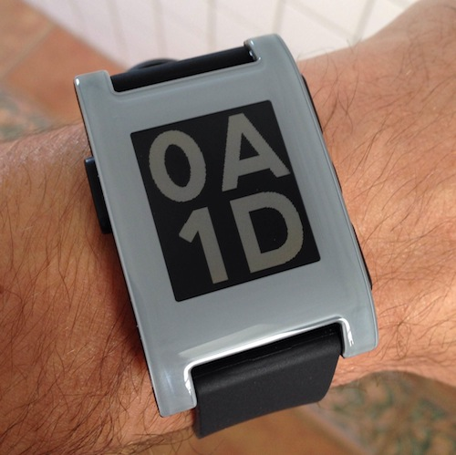

### hex_time

A rip-off of the [`big_time` sample watch face](https://github.com/pebble/pebble-sdk-examples/tree/master/watchfaces/big_time), but in hexadecimal. Because hexadecimal! The vestigial, omnipresent 0 in the top left distinguishes it at a glance from `big_time`.

